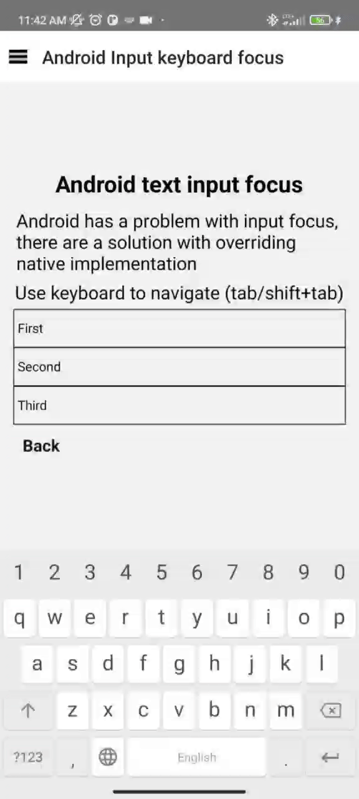

# Support keyboard focus for input on Android

Last update: 04.05.2023

ReactNative has a problem with supporting keyboard focus on Android
https://github.com/facebook/react-native/issues/31820

You can override the native logic of the input component on android to fix this issue. It looks like creating a native component but we extends origin one and override functionality. It's a dirty trick, but can solve problem with supporting keyboard and achieving WCAG. 

We are going to fix this issue from native side, and fix will be applied globally for the whole app.


Example of result: </br>
|


1. First of all we are going to create our own `ReactEditText` implementation extending origin `ReactEditText`.

```

import android.content.Context;
import android.graphics.Rect;
import android.view.View;

import com.facebook.react.views.textinput.ReactEditText;

public class RCTEditText extends ReactEditText {
  public RCTEditText(Context context) {
    super(context);
  }

  @Override
  public boolean requestFocus(int direction, Rect previouslyFocusedRect) {
    if (direction == View.FOCUS_FORWARD || direction == View.FOCUS_BACKWARD) {
      this.requestFocusFromJS();
    }
    return super.requestFocus(direction, previouslyFocusedRect);
  }
}
```

2. Create new `ReactTextInputManager` based on origin `ReactTextInputManager`

To override native component we need to create `ViewManager`, `ReactTextInputManager` has a lot of logic which we need to support so we just extend it and override it's `createViewInstance`

```
import com.facebook.react.uimanager.ThemedReactContext;
import com.facebook.react.views.textinput.ReactEditText;
import com.facebook.react.views.textinput.ReactTextInputManager;

class RCTEditTextManager extends ReactTextInputManager {
  // Copied react native text input manager, just copy pasted
  @Override
  public ReactEditText createViewInstance(ThemedReactContext context) {
    //Changed this line
    ReactEditText editText = new RCTEditText(context);
    int inputType = editText.getInputType();
    editText.setInputType(inputType & -131073);
    editText.setReturnKeyType("done");
    return editText;
  }
}
```

This code repeat original `ReactTextInputManager`, but we return our `RCTEditText` instead of original one.

3. Create package

Old and new versions of RN (old arch/new arch), has different registration of package

For new versions we need to extend `TurboReactPackage`
```

import androidx.annotation.Nullable;
import com.facebook.react.TurboReactPackage;
import com.facebook.react.bridge.NativeModule;
import com.facebook.react.bridge.ReactApplicationContext;
import com.facebook.react.module.model.ReactModuleInfo;
import com.facebook.react.module.model.ReactModuleInfoProvider;
import com.facebook.react.uimanager.ViewManager;
import java.util.ArrayList;
import java.util.HashMap;
import java.util.List;
import java.util.Map;

public class RCTEditTextPackage extends TurboReactPackage {

  @Override
  public @Nullable NativeModule getModule(String name, ReactApplicationContext context) {
    return null;
  }

  @Override
  public List<ViewManager> createViewManagers(ReactApplicationContext reactContext) {
    List<ViewManager> viewManagers = new ArrayList<>();

    viewManagers.add(new RCTEditTextManager());

    return viewManagers;
  }

  @Override
  public ReactModuleInfoProvider getReactModuleInfoProvider() {
    return () -> {
      final Map<String, ReactModuleInfo> moduleInfos = new HashMap<>();
      return moduleInfos;
    };
  }
}
```

For old versions we need to extend `ReactPackage`

```

import androidx.annotation.NonNull;

import com.facebook.react.ReactPackage;
import com.facebook.react.bridge.NativeModule;
import com.facebook.react.bridge.ReactApplicationContext;
import com.facebook.react.uimanager.ViewManager;

import java.util.ArrayList;
import java.util.Collections;
import java.util.List;

public class RCTEditTextPackage implements ReactPackage {
    @NonNull
    @Override
    public List<NativeModule> createNativeModules(@NonNull ReactApplicationContext reactContext) {
        return Collections.emptyList();
    }

    @NonNull
    @Override
    public List<ViewManager> createViewManagers(@NonNull ReactApplicationContext reactContext) {
        List<ViewManager> viewManagers = new ArrayList<>();
        viewManagers.add(new RCTEditTextManager());
        return viewManagers;
    }
}
```

4. Add our package to `MainApplication`
We need to add our new package to `packages` list.

``` 
    //MainApplication.java

    @Override
    protected List<ReactPackage> getPackages() {
        @SuppressWarnings("UnnecessaryLocalVariable")
        List<ReactPackage> packages = new PackageList(this).getPackages();
        packages.add(new RCTEditTextPackage());

        return packages;
    }
```

You can compare results with mine here:

`react-native-a11y/examples/A11ySample/android/app/src/main/java/com/a11ysample/textinput` for the old arch [link](../examples/A11ySample/android/app/src/main/java/com/a11ysample/textinput)
</br>
`react-native-a11y/examples/A11yNewArch/android/app/src/main/java/com/a11ynewarch/textinput` for the new arch [link](../examples/A11yNewArch/android/app/src/main/java/com/a11ynewarch/textinput)


Thats all, you can build and try to focus your inputs with keyboard